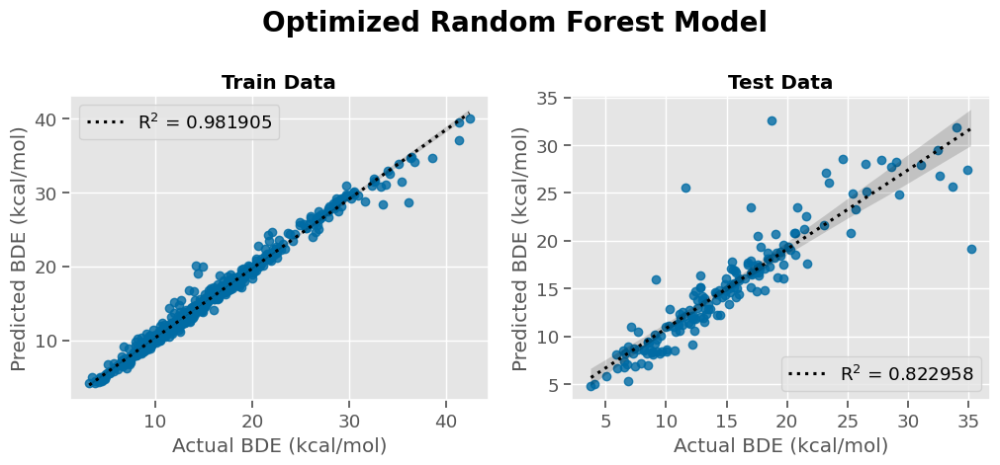
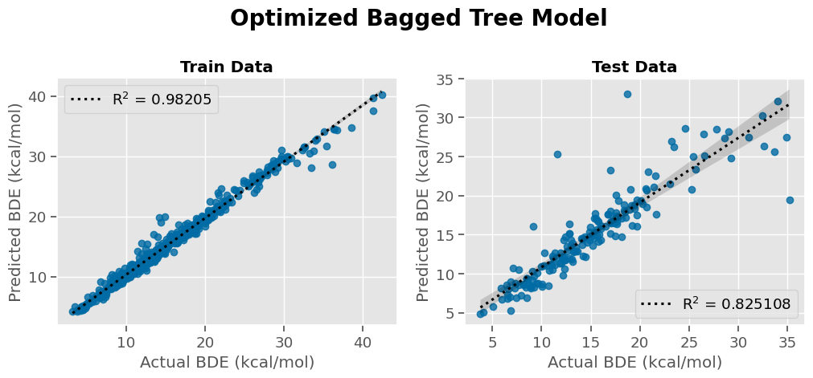
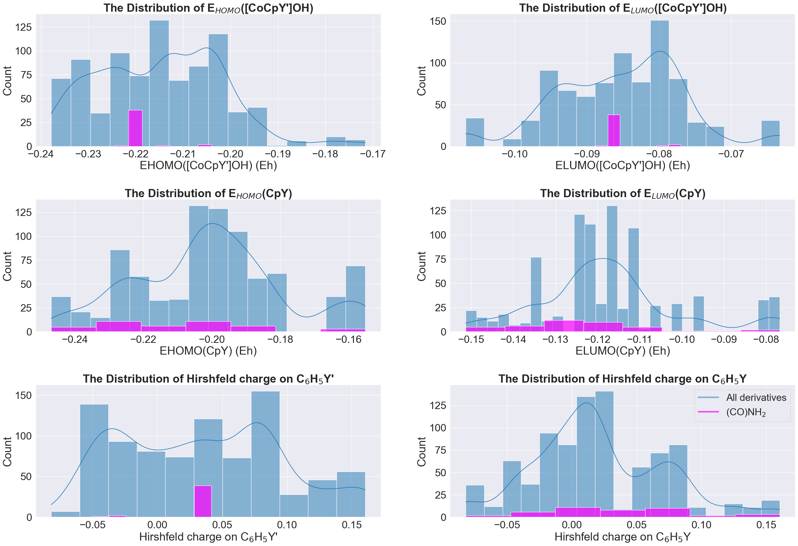
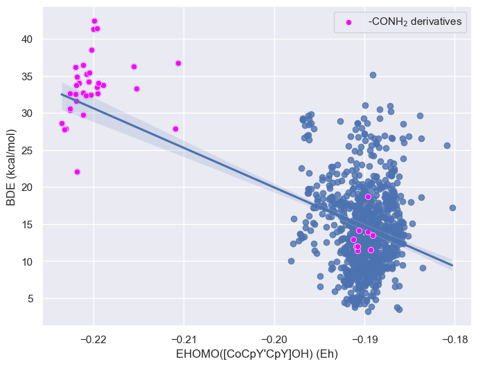

# Predicting the stability of cobaltocenium derivatives 

Author: Shehani Wetthasinghe

Last modified: 02/25/2023

- According to the previous experimental work, cobaltocenium derivatives (CoCp2OH) are regarded as promising anion exchange membrane (AEM) components because of their excellent thermal and alkaline stability under operating conditions of fuel cells.
- In this project,  I provide a useful guidance for experimentalists to find out the stable cobaltocenium derivatives by introducing a machine learning model.
- The stability can be interpreted as measure of bond dissociation energy (BDE). 
- After an extensive analysis, I found that BDE can be predicted using few chemical properties of the fragments of cobaltocenium derivatives based on its substituents.

Here are the substituents used in this study:

Check out following publications for more information about the theory model;
* https://pubs.acs.org/doi/10.1021/acs.jpca.1c10603
* https://pubs.acs.org/doi/10.1021/acs.jctc.1c01201

## Data Generation
I generated the data set with every possible di-substituted cobatocenium derivatives for 42 substituents. So here I share the python codes that I used for;
* generating input files for QChem calculations
* data extraction from QChem output files
* property calculation and data analysis

This is the procedure need to follow to add a new substituent;

**Guidlines to generate input files**

First, QChem input files for di-substituted CoCp2OH are required to generate with a given substituent set. To do that, xyz coordinates for di-substuted CoCp2OH are creating by;
* connecting one group directly to 15th  atom (C) 
* connecting the second group to 4th  atom (C) with a coordination rotation through z axis

Steps:
* Optimize the geometry of mono-substituted cobaltocenium with the new substituent group. (input file: Cobaltocenium_project/mono_sub_opt_sample.in) 
* Extract the xyz coordinates of optimized output files using "extract_subcor.py"
* Do any required changes in rem/pcm//basis set/charge/multiplicity in corresponding data files or di_input_generator.py (rem.dat, pcm.dat, basis.dat, "char" or "multi" variables in di_input_generator.py)
* Run "di_input_generator.py"

**Guidlines to submit mutiple QChem files**
*  Run "multi_cal.sh" file to submit the geometry optimization calculations in the serial manner. (It followes the list of di-substituted CoCp2OH in "der.dat" file which automatically generate by running the "di_input_generator.py" )

**Guidlines to data extraction, property calculation and data analysis**

* As the next task, the required data is needed to extract from the QChem output files and then calculate further chemical properties. For these calculations, previously calculated data for fragments is also needed. (ex: cp_homo.dat, cp_lumo.dat, cocp_homo.dat, cocp_lumo.dat, h_charge.dat) 

* Geometry optimaization calculations can be performed using "cocp_frag_opt.in" and "cp_frag_opt.in" for CoCpOH and Cp fragments respectively. Then required data can be extracted to following data files using "frag_extract.py"
  * Energy of substituted CoCpOH fragment:                                                cocp.dat
  * Energy of substituted Cp fragment:                                                    cp.dat
  * Energy of highest occupied molecular orbital (HOMO) for substituted CoCpOH fragment:  cocp_homo.dat
  * Energy of lowest unoccupied molecular orbital (LUMO) for substituted CoCpOH fragment: cocp_lumo.dat
  * Energy of HOMO for substituted Cp fragment:                                           cp_homo.dat
  * Energy of LUMO for substituted Cp fragment:                                           cp_lumo.dat
  
 * For the Hirshfeld charge calculation;
    * Create the input file for geometry optimization of substituted benzene using "h_charge_opt.in"
    * Perfom the Hirshfeld charge calculation by adding the optimized geometry to "h_charge_sub.in"
    * Use "h_charge_calculator.py" to calculate the sum of Hirshfeld charge on C6H5 for each substituent and generate the "h_charge.dat" file
    
  * Once all required data files are created, "data.py" can be used to calculate BDE and other chemical properties for di-substituted complexes. (Note: Do the necessary changes in data.py file as in the comments)

The extracted data has published in Open Source Framework (OSF) and the link to the database is attached below;

https://osf.io/6za8c/

## Machine Learning Models

**NOTE:**
Before applying the machine learning techniquies, derivatives below the DFT accuracy 3 kcal/mol of BDE were removed.

The following heat map illustrates the correlation between the features of fragments based on the generated data.

First, I tried out few regression machine learning models with the default parameters. The following table shows their performence;
|Model|Train R2|Test R2|Train RMSE \(kcal/mol\)|Test RMSE \(kcal/mol\)|
|---|---|---|---|---|
|Linear Regression|0\.459858|0\.400263|4\.857049|5\.170292|
|Decision Tree|1|0\.500963|0|4\.716295|
|Bagged Tree|0\.968559|0\.758548|1\.171838|3\.280576|
|KNN|0\.699967|0\.428702|3\.619956|5\.046217|
|Random Forest|0\.982086|0\.795065|0\.884542|3\.022334|
|SVG|0\.479298|0\.378495|4\.768846|5\.263284|
|XG Boost|0\.905036|0\.844032|2\.036564|2\.636647|

- Since test R$^2$ scores are very poor compared to train R$^2$ scores, all models are suffering from over-fitting issue and it is also confirmed by the large test RMSE scores over train RMSE.
- Out of these 7 models, XG Boost, random forest and bagged tree are selected based on the test scores for further optimizations.
 
 The following table illustrates the performance of the models after tunning the hyperparameters and carrying out the cross validation (folds = 5);
 
|Model|Train R2|Test R2|Train RMSE \(kcal/mol\)|Test RMSE \(kcal/mol\)|
|---|---|---|---|---|
|XG Boost|0\.986399|0\.845785|0\.770731|2\.621787|
|Random Forest|0\.979996|0\.798638|0\.9347|2\.995871|
|Bagged Tree|0\.980953|0\.801947|0\.912076|2\.971157|

- Out of the optimized models, XG Boost machine learning model is the best performing model by having the highest R$^2$ and lowest RMSE test scores. 
- Yet, the test scores are lower than the train scores even for the optimized models. 

- According to the test results of each model illustrated above, there is a similarity in the pattern of deviated points from the trend line when actual BDE $>$ 30 kcal/mol. 
- These outliers are the ones which cause to generate lower test scores. Therefore, the deviated derivatives were investigated further. 
- First, the common outliers for all three optimized models were identified by calculating  $\lvert$ Actual BDE - Predicted BDE $\rvert$. 
- Below figire, shows the list top 9 outliers where $\lvert$ Actual BDE - Predicted BDE $\rvert$ $>$ 4 kcal/mol.

- Seven of the nine outliers consist (CO)NH₂	group either in CoCpY$'$ or CpY. Consequently, the (CO)NH₂ derivatives were sliced out and the distribution of the data was re-analyzed across each input feature.

- As the above figure, the (CO)NH₂ derivatives do not appear as outliers when the entire data set is distributed across each input feature. However, since the input features do not provide a clear indication of (CO)NH₂ derivatives as outliers, it may be necessary to analyze a different property.

- The properties of the substituted CoCp_2OH complex that were not utilized as input features for the machine learning models, but were employed to determine the BDE, as well as the HOMO and LUMO energies of the complex, were analyzed in the subsequent step. The selected properties are listed below;

  - Energy of Co[CpY][CpY']OH 
  - Energy of CoCpY'energy
  - CpY energy
  - BDE (target variable)
  - HOMO energy of Co[CpY][CpY']OH
  - LUMO energy of Co[CpY][CpY']OH

- Based on the data presented in above plots, it is evident that (CO)NH₂ derivatives appear as significant outliers in the distribution of HOMO energy of the complex.
- Due to the peculiar behavior of (CO)NH₂ derivatives, they were removed from the data set and then tried with the selected machine learning models to investigate whether they make a significant difference in the performance.

